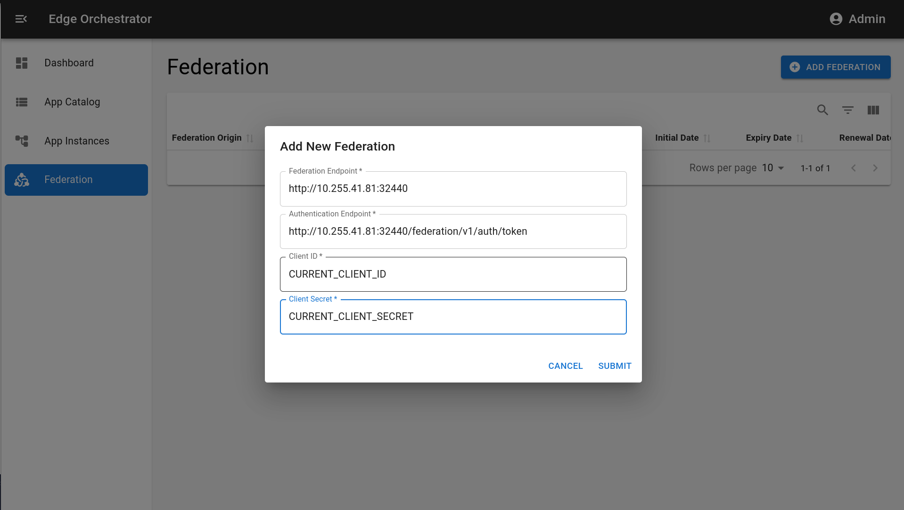

# MEC Federator

This MEC Federator was developed in accordance with ETSI and GSMA-related specifications. It was built to work with the ATNoG OSM-MEC platform, communicating with our MEC Orchestrator, enhancing it with federation capabilities.

## Evaluation

The federation capabilities of this component, in coordination with the ATNoG OSM-MEC, were evaluated using the test application available at https://github.com/ATNoG/mec-test-app. This repository also stores the performed tests and their results.

## Create a new federation

To create a new federation relationship, you must go to the federation tab on the menu, select the button `Add Federation`, and fill it with the following information:
- Federation Endpoint: partner's MEF endpoint.
- Authentication Endpoint: partner's MEF authentication endpoint.
- Client ID: origin operator client ID (the one created in KeyCloak).
- Client Secret: origin operator client secret (the one created in KeyCloak).

Example: 

